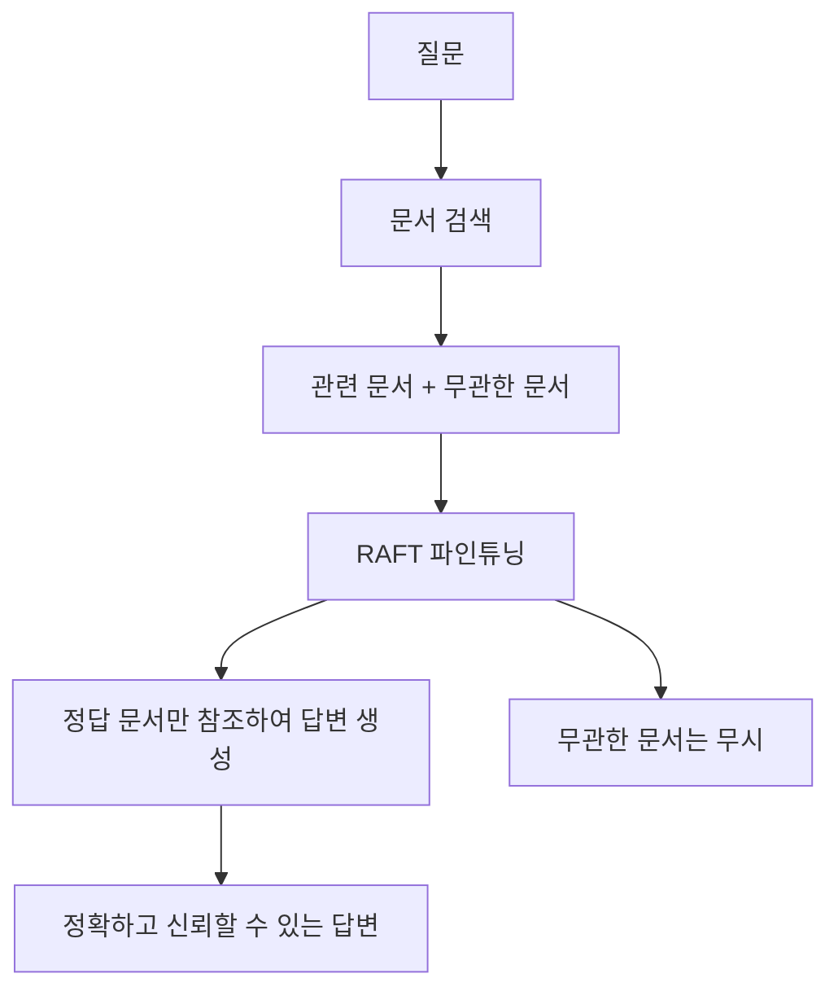

# RAFT 기반 RAG 전용 SLLM 파인튜닝


## 📋 목차

1. [프로젝트 개요](#-프로젝트-개요)
2. [핵심 기술 소개](#-핵심-기술-소개)
3. [프로젝트 구조](#-프로젝트-구조)
4. [환경 설정](#-환경-설정)
5. [데이터 준비 과정](#-데이터-준비-과정)
6. [파인튜닝 과정](#-파인튜닝-과정)
7. [vLLM을 활용한 RAG 시스템](#-vllm을-활용한-rag-시스템)
8. [실행 가이드](#-실행-가이드)
9. [성능 최적화 팁](#-성능-최적화-팁)
10. [참고 자료](#-참고-자료)

## 🎯 프로젝트 개요

본 프로젝트는 **RAFT(Retrieval Augmented Fine Tuning)** 기법을 활용하여 한국어 도메인에 특화된 RAG(Retrieval-Augmented Generation) 시스템을 구축하는 것을 목표로 합니다.

### 주요 특징

- 🔍 **RAFT 기법**: 문서 검색과 생성을 통합한 효율적인 파인튜닝
- 🚀 **vLLM**: 고성능 추론 및 서빙을 위한 최적화된 라이브러리
- 🎛️ **LoRA**: 메모리 효율적인 파라미터 효율적 파인튜닝
- 🇰🇷 **한국어 특화**: KLUE-MRC 데이터셋 기반 한국어 질의응답 시스템

### 프로젝트 목적

1. **도메인 특화 RAG 시스템 구축**: 특정 도메인의 문서에서 정확한 정보를 검색하고 답변을 생성
2. **효율적인 파인튜닝**: LoRA를 활용한 메모리 효율적인 모델 학습
3. **고성능 추론**: vLLM을 통한 빠르고 효율적인 모델 서빙
4. **실무 적용 가능한 시스템**: 실제 운영 환경에서 사용 가능한 RAG 파이프라인

## 🔬 핵심 기술 소개

### RAFT (Retrieval Augmented Fine Tuning)

RAFT는 2024년에 발표된 혁신적인 파인튜닝 기법으로, RAG 시스템의 성능을 크게 향상시킵니다.

#### RAFT의 핵심 아이디어



#### RAFT의 학습 전략

1. **Positive Documents**: 질문에 대한 정답이 포함된 문서
2. **Negative Documents**: 질문과 유사하지만 정답이 없는 혼란스러운 문서  
3. **Citation Learning**: 답변에서 참조한 문서 번호를 명시하도록 학습

```python
# RAFT 학습 데이터 예시
{
    "question": "대한민국의 수도는 어디인가요?",
    "docs": [
        "doc1: 대한민국의 수도는 서울특별시입니다.",  # Positive
        "doc2: 일본의 수도는 도쿄입니다.",              # Negative  
        "doc3: 중국의 수도는 베이징입니다.",            # Negative
        "doc4: 서울은 한강을 중심으로 발전했습니다.",    # Negative
        "doc5: 부산은 대한민국의 제2의 도시입니다."      # Negative
    ],
    "answer": "대한민국의 수도는 서울특별시입니다[[doc1]]."
}
```

#### RAFT 데이터셋 구성 정리

##### 1. 논문 근거 기반 요소

- **골든 문서 + 네가티브 샘플(디스트랙터) 조합**
  - 기본적으로 질문(Q) + 골든 문서(D*) + k개의 디스트랙터(Di)로 구성
  - 실험에서는 보통 1개의 골든 문서 + 4개의 디스트랙터 사용

- **디스트랙터 개수 다양화**
  - k값을 달리하여(0~n) 모델이 다양한 retrieval 상황에 견고해지도록 훈련

- **여러 문서 조합 (멀티골든)**
  - HotpotQA 같은 경우 정답이 여러 문서에서 유도될 수 있어, 골든 문서가 복수일 수 있음

- **체인오브쏘트(CoT) + 인용 포함**
  - 답변은 reasoning 과정을 반드시 포함하고, 문서 인용(##begin_quote## … ##end_quote##)을 명시하도록 구성

##### 2. 변경된 내역 (본 프로젝트 적용 버전)

- **질문 패러프레이징 (명사구 변환 등)**
  - 논문에는 없는 아이디어. 데이터 다양화와 일반화 성능 강화를 위해 추가

- **질문에 대한 컨텍스트가 없는 데이터 제거**
  - 논문에서는 (1−P)% 샘플에서 골든 문서를 제거하고 디스트랙터만 넣는 방식을 사용
  - 하지만 실제 실험에서는 over-refusal 문제(모델이 무응답/회피 → recall 하락)를 야기해 제외함

### vLLM (Very Large Language Model Serving)

vLLM은 UC Berkeley에서 개발한 고성능 LLM 추론 라이브러리입니다.

#### 주요 기술

1. **PagedAttention**: 
   - 운영체제의 가상 메모리 기법을 LLM에 적용
   - KV 캐시를 페이지 단위로 관리하여 메모리 효율성 극대화
   - 기존 대비 최대 24배 빠른 처리량 달성

2. **Continuous Batching**:
   - 동적 배치 처리로 GPU 활용도 극대화
   - 요청별 생성 길이가 달라도 효율적으로 처리

3. **Optimized CUDA Kernels**:
   - NVIDIA GPU에 최적화된 커널로 연산 가속화

### LoRA (Low-Rank Adaptation)

LoRA는 대형 언어 모델을 효율적으로 파인튜닝하는 기법입니다.

#### LoRA의 원리

```python
# 기존 Linear Layer: W ∈ R^(d×k)
# LoRA: W + ΔW, where ΔW = BA
# B ∈ R^(d×r), A ∈ R^(r×k), r << min(d,k)

class LoRALinear(nn.Module):
    def __init__(self, in_features, out_features, rank=8):
        super().__init__()
        self.lora_A = nn.Linear(in_features, rank, bias=False)
        self.lora_B = nn.Linear(rank, out_features, bias=False)
        self.scaling = 1.0 / rank
        
    def forward(self, x):
        # 원본 가중치는 고정, LoRA 부분만 학습
        return self.lora_B(self.lora_A(x)) * self.scaling
```

#### LoRA의 장점

- **메모리 효율성**: 전체 파라미터의 0.1-1%만 학습
- **빠른 학습**: 학습 시간과 메모리 사용량 대폭 감소
- **모듈화**: 여러 태스크별 LoRA 어댑터를 쉽게 교체 가능

## 📁 프로젝트 구조

```
raft/
├── README.md                          # 프로젝트 설명서 (이 파일)
├── 2403.10131v2.pdf                   # RAFT 논문 원본
├── 01_데이터준비/                      # 데이터 전처리 및 준비
│   ├── 01_klue-mrc_negative_samples.ipynb          # Negative sampling
│   ├── 02_klue_mrc_prompt_docs_5_answer.ipynb      # 5개 문서 조합 데이터
│   ├── 03_klue_mrc_prompt_docs_1_4_answer.ipynb    # 1+4 문서 조합 데이터  
│   ├── 04_klue_mrc_nominal_question_docs_1_5_answer.ipynb # 명사형 질문 데이터
│   ├── 05_klue_mrc_prompt_multidocs_answer.ipynb   # 다중 문서 복합 질문
│   ├── klue-mrc-v1.1_train.json                   # KLUE-MRC 원본 데이터
│   └── *.csv                                       # 전처리된 데이터 파일들
├── 02_finetuning/                     # 모델 파인튜닝 및 추론
│   ├── 06_fine_tuning.ipynb                       # RAFT 파인튜닝 실행
│   ├── 07_vllm_rag.ipynb                          # vLLM RAG 시스템 구현
│   └── [GIP] 2025 국가별 ICT 시장동향_보고서_미국.pdf  # RAG 테스트용 문서
```

## 🔧 환경 설정

### 시스템 요구사항

- **GPU**: NVIDIA GPU (CUDA 지원, 16GB+ VRAM 권장)
- **메모리**: 32GB+ RAM 권장
- **저장공간**: 100GB+ 여유 공간
- **Python**: 3.8+

### 필수 라이브러리 설치

```bash
# 기본 라이브러리
pip install torch torchvision torchaudio --index-url https://download.pytorch.org/whl/cu118

# Hugging Face 생태계
pip install transformers datasets accelerate tokenizers

# 파인튜닝 관련
pip install peft trl bitsandbytes

# vLLM 설치
pip install vllm

# RAG 관련
pip install langchain langchain-community langchain-huggingface
pip install chromadb pypdf sentence-transformers

# 임베딩 및 유틸리티
pip install FlagEmbedding scikit-learn pandas numpy tqdm

# 시각화 및 기타
pip install matplotlib seaborn jupyter
```

### GPU 환경 확인

```python
import torch
print(f"CUDA available: {torch.cuda.is_available()}")
print(f"GPU count: {torch.cuda.device_count()}")
print(f"Current GPU: {torch.cuda.get_device_name(0)}")
```

## 📊 데이터 준비 과정

### 1. KLUE-MRC 데이터셋 다운로드

```python
# KLUE-MRC v1.1 데이터셋 (46MB)
!wget https://github.com/KLUE-benchmark/KLUE/raw/refs/heads/main/klue_benchmark/klue-mrc-v1.1/klue-mrc-v1.1_train.json
```

### 2. Negative Sampling 전략

RAFT의 핵심은 **Hard Negative Sampling**입니다. 모델이 혼동할 수 있는 유사하지만 부정확한 문서를 생성합니다.

```python
# BGE-M3 임베딩 모델 사용
from FlagEmbedding import BGEM3FlagModel

model = BGEM3FlagModel('BAAI/bge-m3', use_fp16=True)

# 코사인 유사도 기반 상위 4개 negative samples 추출
similarity_matrix = cosine_similarity(question_embeds, context_embeds)
np.fill_diagonal(similarity_matrix, -np.inf)  # 자기 자신 제외

topk_idx = np.argpartition(similarity_matrix, -4, axis=1)[:, -4:]
negative_samples = [[context_list[i] for i in row] for row in topk_idx]
```

### 3. 다양한 데이터 조합 생성

#### A. 5개 문서 조합 (1 Positive + 4 Negative)
```python
docs = [positive_context] + negative_samples[:4]
```

#### B. 복합 질문 생성 (Multi-Document QA)
```python
# 여러 문서에서 정보를 종합해야 하는 복잡한 질문 생성
question = "A와 B의 차이점과 C에 미치는 영향을 설명해주세요."
```

### 4. 데이터 포맷 변환

OpenAI Chat Completion 형식으로 변환:

```python
def format_data(row):
    system_prompt = """당신은 주어진 여러 문서(docs)를 바탕으로, 사용자의 질문에 최대한 정확하게, 그리고 문서 내에서만 정보를 근거로 하여 답변하는 AI 비서입니다.
    
아래 지침을 반드시 지켜주세요:
- 답변은 반드시 docs에서 찾은 내용에 한해서만 작성해주세요.
- 답변에서 인용하는 부분이 있다면, 반드시 해당 문서의 번호(예: [[doc1]], [[doc2]])로 근거를 표시해 주세요.
- 모든 답변은 존댓말을 사용하세요."""

    docs_str = '\n'.join([f"doc{i+1}: {doc}" for i, doc in enumerate(row['docs'])])
    
    user_prompt = f"""질문: {row['question']}

docs:
{docs_str}

위의 docs 중에서만 정보를 근거로 하여, 질문에 답변해 주세요."""

    return {
        "messages": [
            {"role": "system", "content": system_prompt},
            {"role": "user", "content": user_prompt},
            {"role": "assistant", "content": row['answer']}
        ]
    }
```

## 🎯 파인튜닝 과정

### 1. 베이스 모델 선택

```python
# NCSOFT의 한국어 특화 Llama 모델 사용
pretrained_model_name = "NCSOFT/Llama-VARCO-8B-Instruct"

model = AutoModelForCausalLM.from_pretrained(
    pretrained_model_name,
    device_map="auto",
    torch_dtype=torch.bfloat16,  # 메모리 효율성을 위한 16비트 정밀도
)
```

### 2. LoRA 설정

```python
from peft import LoraConfig

peft_config = LoraConfig(
    lora_alpha=32,           # LoRA 스케일링 팩터
    lora_dropout=0.1,        # 과적합 방지
    r=8,                     # LoRA 랭크 (정보량/복잡도)
    bias="none",             # bias 파라미터 학습 안함
    target_modules=["q_proj", "v_proj"],  # Attention의 Q,V projection에만 적용
    task_type="CAUSAL_LM",   # 언어 생성 태스크
)
```

### 3. 학습 설정

```python
from trl import SFTConfig, SFTTrainer

args = SFTConfig(
    output_dir="llama3-8b-rag-ko",
    num_train_epochs=3,
    per_device_train_batch_size=2,
    gradient_accumulation_steps=2,    # 실질적 배치 크기: 2*2=4
    gradient_checkpointing=True,      # 메모리 절약
    optim="adamw_torch_fused",       # 최적화된 AdamW
    learning_rate=1e-4,              # 학습률
    bf16=True,                       # bfloat16 연산
    max_seq_length=8192,             # 최대 시퀀스 길이
    logging_steps=10,
    save_steps=50,
)
```

### 4. 데이터 콜레이터 (핵심!)

RAFT의 핵심은 **정답 부분만 학습**하도록 하는 것입니다:

```python
def data_collator(batch):
    new_batch = {"input_ids": [], "attention_mask": [], "labels": []}
    
    for example in batch:
        # LLaMA-3 채팅 템플릿 적용
        prompt = "<|begin_of_text|>"
        for msg in example["messages"]:
            role = msg["role"]
            content = msg["content"].strip()
            prompt += f"<|start_header_id|>{role}<|end_header_id|>\n{content}<|eot_id|>"
        
        # 토크나이징
        tokenized = tokenizer(prompt, truncation=True, max_length=max_seq_length)
        input_ids = tokenized["input_ids"]
        labels = [-100] * len(input_ids)  # 기본적으로 모든 토큰 무시
        
        # assistant 답변 부분만 학습 대상으로 설정
        assistant_start = "<|start_header_id|>assistant<|end_header_id|>\n"
        assistant_tokens = tokenizer.encode(assistant_start, add_special_tokens=False)
        
        # assistant 구간 찾아서 labels에 실제 토큰 값 복사
        for i in range(len(input_ids) - len(assistant_tokens)):
            if input_ids[i:i+len(assistant_tokens)] == assistant_tokens:
                start_idx = i + len(assistant_tokens)
                # <|eot_id|>까지 찾아서 해당 구간을 학습 대상으로 설정
                # ... (상세 구현은 코드 참조)
        
        new_batch["input_ids"].append(input_ids)
        new_batch["labels"].append(labels)
    
    return new_batch
```

### 5. 학습 실행

```python
trainer = SFTTrainer(
    model=model,
    args=args,
    train_dataset=train_dataset,
    data_collator=data_collator,
    peft_config=peft_config
)

trainer.train()  # 학습 시작!
```

## 🚀 vLLM을 활용한 RAG 시스템

### 1. 모델 병합 및 준비

```python
from peft import AutoPeftModelForCausalLM

# LoRA 어댑터를 베이스 모델에 병합
peft_model = AutoPeftModelForCausalLM.from_pretrained("checkpoint-846")
merged_model = peft_model.merge_and_unload()

# vLLM용으로 저장
merged_model.save_pretrained("./llama3-8b-rag-ko-merged")
```

### 2. vLLM 서버 초기화

```python
from vllm import LLM, SamplingParams

# vLLM 모델 로드
vllm_model = LLM(
    model="./llama3-8b-rag-ko-merged",
    dtype="bfloat16",
    gpu_memory_utilization=0.5  # GPU 메모리의 50% 사용
)

# 생성 파라미터
sampling_params = SamplingParams(
    temperature=0,      # 결정적 생성
    max_tokens=1024,    # 최대 생성 토큰
)
```

### 3. 벡터 데이터베이스 구축

```python
from langchain_community.document_loaders import PyPDFLoader
from langchain.text_splitter import RecursiveCharacterTextSplitter
from langchain_community.vectorstores import Chroma
from langchain_huggingface import HuggingFaceEmbeddings

# 문서 로드 및 청킹
loader = PyPDFLoader("document.pdf")
documents = loader.load()

text_splitter = RecursiveCharacterTextSplitter(
    chunk_size=1000,
    chunk_overlap=200,
)
chunks = text_splitter.split_documents(documents)

# 임베딩 모델
embeddings = HuggingFaceEmbeddings(
    model_name="BAAI/bge-m3",
    model_kwargs={'device': 'cuda'}
)

# 벡터 데이터베이스 구축
vectorstore = Chroma.from_documents(chunks, embeddings)
retriever = vectorstore.as_retriever(search_kwargs={"k": 3})
```

### 4. RAG 파이프라인 구현

```python
def generate_rag_response(question, retriever, tokenizer, vllm_model, sampling_params):
    # 1. 문서 검색
    retrieved_docs = retriever.invoke(question)
    
    # 2. 문서 포맷팅
    docs_str = '\n'.join([f"doc{i+1}: {doc.page_content}" 
                         for i, doc in enumerate(retrieved_docs)])
    
    # 3. 프롬프트 구성
    messages = [
        {"role": "system", "content": system_prompt},
        {"role": "user", "content": f"""질문: {question}

docs:
{docs_str}

위의 docs 중에서만 정보를 근거로 하여, 질문에 답변해 주세요."""}
    ]
    
    # 4. 채팅 템플릿 적용
    prompt = tokenizer.apply_chat_template(
        messages, tokenize=False, add_generation_prompt=True
    )
    
    # 5. vLLM으로 생성
    outputs = vllm_model.generate([prompt], sampling_params)
    response = outputs[0].outputs[0].text
    
    return response
```

## 🎮 실행 가이드

### 단계별 실행 순서

1. **환경 설정**
   ```bash
   git clone <repository>
   cd raft
   pip install -r requirements.txt
   ```

2. **데이터 준비**
   ```bash
   # 01_데이터준비 폴더의 노트북들을 순서대로 실행
   jupyter notebook 01_데이터준비/01_klue-mrc_negative_samples.ipynb
   ```

3. **모델 파인튜닝**
   ```bash
   jupyter notebook 02_finetuning/06_fine_tuning.ipynb
   ```

4. **RAG 시스템 테스트**
   ```bash
   jupyter notebook 02_finetuning/07_vllm_rag.ipynb
   ```

### 주요 하이퍼파라미터 튜닝 가이드

#### LoRA 설정
- `r=8`: 일반적인 설정, 성능 향상이 필요하면 16으로 증가
- `lora_alpha=32`: r의 4배 정도로 설정하는 것이 일반적
- `lora_dropout=0.1`: 과적합 방지, 0.05-0.2 범위에서 조정

#### 학습 설정
- `learning_rate=1e-4`: LoRA의 일반적인 학습률
- `batch_size`: GPU 메모리에 따라 조정 (2-8)
- `gradient_accumulation_steps`: 실질적 배치 크기 조정

#### vLLM 설정
- `gpu_memory_utilization=0.5`: GPU 메모리 사용률 (0.3-0.9)
- `max_tokens=1024`: 생성할 최대 토큰 수

### 메모리 사용량 최적화

```python
# 메모리 부족 시 설정
model = AutoModelForCausalLM.from_pretrained(
    model_name,
    device_map="auto",
    torch_dtype=torch.bfloat16,
    load_in_8bit=True,  # 8비트 양자화
    # load_in_4bit=True,  # 더 극단적인 메모리 절약
)
```

## ⚡ 성능 최적화 팁

### 1. 데이터 최적화

- **청킹 전략**: 문서 길이에 따른 최적 청크 크기 설정
- **Negative Sampling**: 너무 쉽거나 어려운 negative 제거
- **데이터 품질**: 중복 제거, 노이즈 데이터 정제

### 2. 모델 최적화

- **Mixed Precision**: bf16 사용으로 메모리 및 속도 개선
- **Gradient Checkpointing**: 메모리 절약
- **Flash Attention**: 가능한 경우 Flash Attention 2.0 사용

### 3. 추론 최적화

- **vLLM 설정**: 적절한 `gpu_memory_utilization` 값 설정
- **배치 처리**: 여러 요청을 배치로 처리
- **KV 캐시**: PagedAttention의 이점 최대 활용

### 4. 시스템 최적화

```python
# CUDA 최적화 설정
import torch
torch.backends.cuda.matmul.allow_tf32 = True
torch.backends.cudnn.allow_tf32 = True
torch.backends.cudnn.benchmark = True
```

## 📈 성능 평가 및 모니터링

### 평가 메트릭

1. **정확성 (Accuracy)**: 정답 문서에서 올바른 정보 추출 여부
2. **인용 정확도 (Citation Accuracy)**: 올바른 문서 번호 인용 여부
3. **무관 문서 무시율**: Negative 문서를 얼마나 잘 무시하는가
4. **응답 품질**: 자연스러운 한국어 생성 여부

### 평가 코드 예시

```python
def evaluate_rag_system(test_dataset, generate_func):
    correct_answers = 0
    correct_citations = 0
    
    for example in test_dataset:
        question = example['question']
        expected_answer = example['answer']
        
        generated_answer = generate_func(question)
        
        # 정확성 평가
        if check_answer_correctness(generated_answer, expected_answer):
            correct_answers += 1
            
        # 인용 평가
        if check_citation_correctness(generated_answer, example['doc_citations']):
            correct_citations += 1
    
    accuracy = correct_answers / len(test_dataset)
    citation_accuracy = correct_citations / len(test_dataset)
    
    return accuracy, citation_accuracy
```

## 🔍 트러블슈팅

### 자주 발생하는 문제들

#### 1. CUDA Out of Memory
```python
# 해결책 1: 배치 크기 감소
per_device_train_batch_size=1
gradient_accumulation_steps=4

# 해결책 2: 모델 양자화
load_in_8bit=True

# 해결책 3: Gradient Checkpointing
gradient_checkpointing=True
```

#### 2. vLLM 초기화 실패
```python
# GPU 메모리 사용률 조정
gpu_memory_utilization=0.3  # 더 보수적으로 설정

# 또는 CPU 사용
device_map="cpu"
```

#### 3. 토크나이저 오류
```python
# 패딩 토큰 설정
if tokenizer.pad_token is None:
    tokenizer.pad_token = tokenizer.eos_token
```

#### 4. 생성 품질 저하
- 학습률 조정: `1e-4 → 5e-5`
- LoRA 랭크 증가: `r=8 → r=16`
- 더 많은 에포크: `epochs=3 → epochs=5`

## 🔬 실험 및 연구 방향

### 추가 실험 아이디어

1. **다양한 Negative Sampling 전략**
   - BM25 기반 하이브리드 검색
   - 의미적 유사도 + 키워드 매칭 조합

2. **모델 크기별 성능 비교**
   - 7B vs 13B vs 70B 모델 성능 분석
   - 파라미터 효율성 vs 성능 트레이드오프

3. **도메인 적응 연구**
   - 의료, 법률, 기술 문서 등 특화 도메인
   - 도메인별 최적 하이퍼파라미터 탐색

4. **다국어 확장**
   - 영어, 중국어, 일본어 등으로 확장
   - 다국어 임베딩 모델 활용

## 📚 참고 자료

### 핵심 논문

1. **RAFT**: [Adapting Language Model to Domain Specific RAG](https://arxiv.org/abs/2403.10131)
2. **vLLM**: [Efficient Memory Management for Large Language Model Serving with PagedAttention](https://arxiv.org/abs/2309.06180)
3. **LoRA**: [Low-Rank Adaptation of Large Language Models](https://arxiv.org/abs/2106.09685)

### 유용한 리소스

- [Hugging Face Transformers 문서](https://huggingface.co/docs/transformers/)
- [vLLM 공식 문서](https://docs.vllm.ai/)
- [LangChain RAG 가이드](https://python.langchain.com/docs/tutorials/rag/)
- [KLUE 벤치마크](https://github.com/KLUE-benchmark/KLUE)

### 추가 학습 자료

- **블로그 포스트**
  - [RAFT 기법 상세 분석](https://blog.example.com/raft-analysis)
  - [vLLM 성능 최적화 가이드](https://blog.example.com/vllm-optimization)

- **YouTube 강의**
  - [RAG 시스템 구축 실전 가이드](https://youtube.com/watch?v=example)
  - [LoRA 파인튜닝 마스터클래스](https://youtube.com/watch?v=example)

## 🤝 기여 및 피드백

### 기여 방법

1. **이슈 리포팅**: 버그나 개선사항 제안
2. **코드 기여**: Pull Request를 통한 코드 개선
3. **문서 개선**: README나 주석 개선
4. **실험 결과 공유**: 새로운 실험 결과나 최적화 방법 공유

---

> **💡 신입 엔지니어를 위한 조언**
> 
> 이 프로젝트는 최신 LLM 기술들이 집약된 종합 프로젝트입니다. 처음에는 복잡해 보일 수 있지만, 각 단계를 차근차근 따라가며 실습해보세요. 특히 다음 순서로 학습하시길 권합니다:
> 
> 1. **기초 개념 이해**: RAFT, vLLM, LoRA의 핵심 아이디어 파악
> 2. **작은 데이터로 실험**: 전체 데이터셋 대신 샘플 데이터로 파이프라인 테스트
> 3. **단계적 확장**: 성공적으로 작동하면 점진적으로 데이터와 모델 크기 확장
> 4. **성능 모니터링**: 각 단계에서 메트릭을 측정하고 개선점 파악
> 5. **실무 적용**: 자신의 도메인에 맞게 커스터마이징
> 
> 궁금한 점이 있으면 언제든 이슈를 통해 질문해주세요!

## 📄 라이선스

이 프로젝트는 MIT 라이선스 하에 배포됩니다. 자세한 내용은 [LICENSE](LICENSE) 파일을 참조하세요.

---

**🚀 Happy Coding! 멋진 RAG 시스템을 만들어보세요!**
